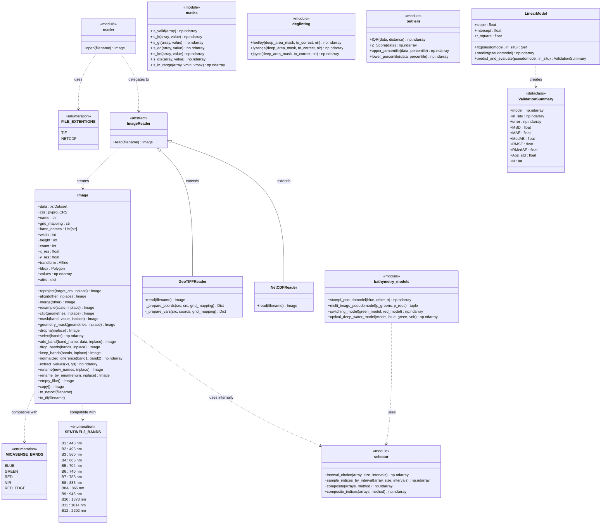

# Class Diagram

This page shows the class structure of the SensingPy package.

## Module Overview

| Module | Type | Responsibility |
|--------|------|----------------|
| `sensingpy.image` | Class | Core geospatial image container and processing |
| `sensingpy.reader` | Factory + Classes | File I/O for GeoTIFF and NetCDF formats |
| `sensingpy.masks` | Functions | Boolean array masking utilities |
| `sensingpy.selector` | Functions | Array sampling and compositing |
| `sensingpy.enums` | Enumerations | Band definitions and file extension constants |
| `sensingpy.preprocessing.deglinting` | Functions | Sun glint correction algorithms |
| `sensingpy.preprocessing.outliers` | Functions | Outlier detection and removal |
| `sensingpy.bathymetry.models` | Functions + Class | Satellite-derived bathymetry (SDB) models |
| `sensingpy.bathymetry.metrics` | Dataclass | SDB validation and error metrics |

## Key Relationships

- **`ImageReader` hierarchy**: `NetCDFReader` and `GeoTIFFReader` both implement `ImageReader.read()`, which always returns an `Image`. The `reader.open()` factory selects the correct reader based on the file extension using `FILE_EXTENTIONS`.
- **`LinearModel` + `ValidationSummary`**: `LinearModel.predict_and_evaluate()` returns a `ValidationSummary` dataclass that exposes error statistics (MAE, RMSE, MedAE, etc.) as properties.
- **`Image` internals**: The `Image` class delegates sampling operations (`interval_choice`, `sample_indices_by_interval`) to the `selector` module and supports renaming bands via `SENTINEL2_BANDS` or `MICASENSE_BANDS` enums.
- **Preprocessing independence**: `deglinting` and `outliers` operate directly on `np.ndarray`, keeping them decoupled from the `Image` class.
